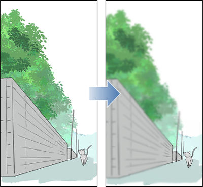
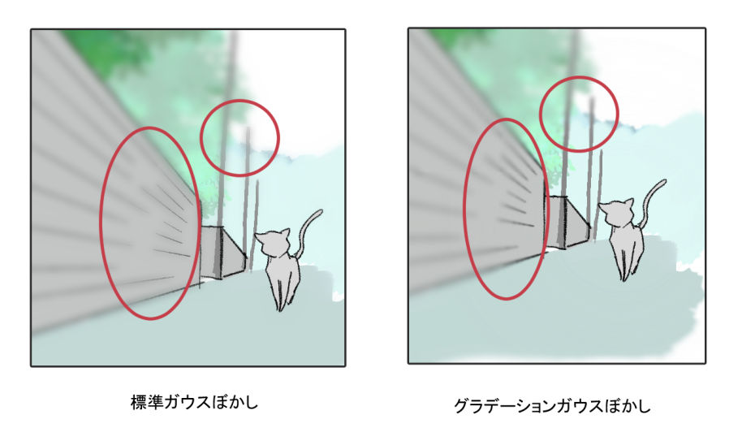
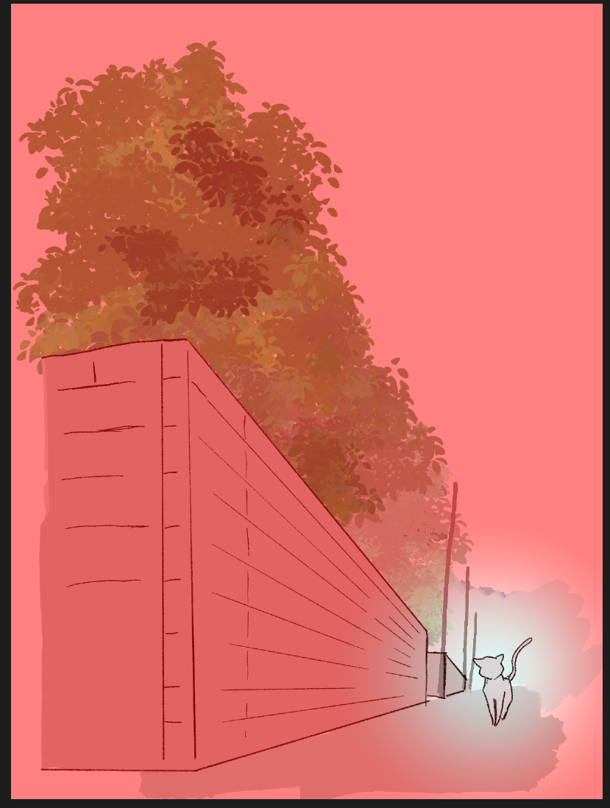
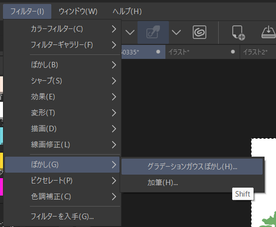
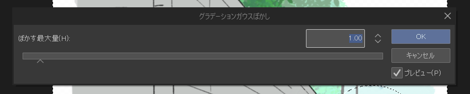
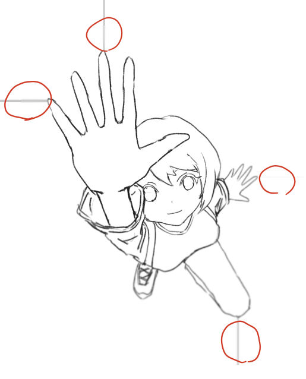

# 動作確認済OS

- Windows：11 Pro 64bit版

# 適用できる対象レイヤー

- ラスターレイヤー（カラー）

# プラグイン概要

選択範囲の透過度によってぼかし量が変化するガウスブラーフィルターです。
クイックマスクと併用して使用します。

境界のぼかしを滑らかにすることができます。奥行きのあるものをぼかす時に便利です。
例：道路、フェンス、レール、ロープ、長い建造物、リボン

# プラグインを利用した際（適用前→適用後 等）のイメージ画像

標準のガウスぼかしと比較して境界部のぼけが滑らかになります。

# プラグインの使用方法

## 1. ぼかす範囲のクイックマスクを作成する。

クイックマスクを使ってぼかす範囲を選択します。
この時にぼかしを弱くしたい個所を薄く選択することでぼかし効果が弱くなります。

グラデーションツールで作成するときれいになります。

※ 選択範囲を作成しない場合、フィルターがかかりません。

## 2. グラデーションガウスぼかしを実行する。

2.1 「フィルター」→ 「ぼかし」→ 「グラデーションガウスぼかし」を選択

2.2 ぼかしの量を指定

選択範囲の不透明度が最大の時のぼかし量を指定します。
ぼかし量は最大を100％として不透明度に応じて減衰します。

### ※ ぼかし量と計算量について

このガウスぼかしは基本計算式で計算しているため、大きなぼかし量を指定するとフィルター処理に時間がかかります。
最大ぼかし量が 4 を超えるとそこそこ時間がかかってきます。（確認環境での例）

-----

# 備考
このフィルターの癖についての説明。

### 虚像について

ブロック境界部に線が出てくることがあります。

-----

### 開発情報

https://github.com/Dolphin-AKI/CLIPPlugin-GradientGaussianBlur
